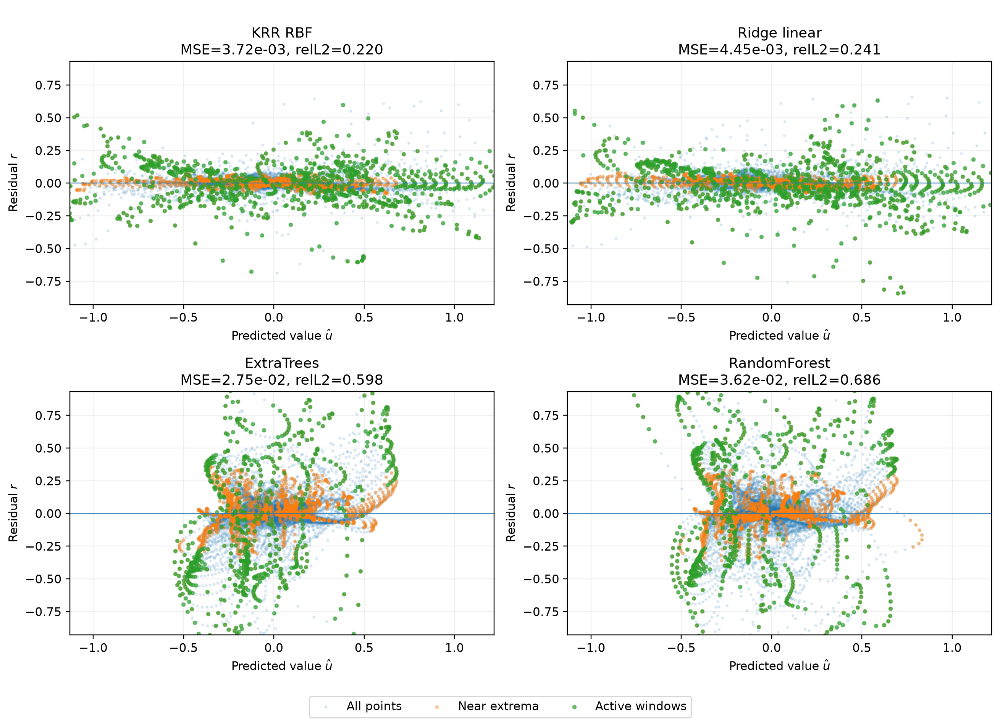
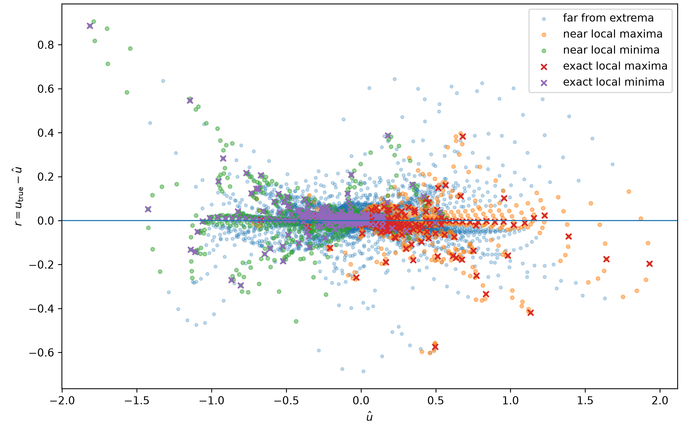

# Structured Extrema Errors in Classical Surrogates for Viscous Burgers

Research paper on the prediction errors of machine-learning surrogates for the one-dimensional viscous Burgers equation.

**Author:** Youssef Oubari — IMT Atlantique, France

📄 [Read the paper](structured_extrema_burgers.pdf)

> **Status:** arXiv submission pending.  
> Submitted to **XAI4Science @ NeurIPS 2026** and **ML4PS** — awaiting review.

---

## Overview

This work studies **how different machine-learning models fail when learning nonlinear PDE dynamics**, and whether these errors can be understood and corrected.

We compare several classical ML models:

- RBF Kernel Ridge Regression
- Linear Ridge Regression
- ExtraTrees
- Random Forests

The analysis includes:

- supervised learning on raw spatial states;
- kernel methods and regularized regression;
- tree ensembles;
- trajectory-level train/validation splitting;
- cross-fitting and held-out evaluation;
- residual analysis;
- PCA and local geometric analysis;
- regression-based feature attribution;
- negative controls;
- spectral analysis;
- gradient-boosting error correction;
- recursive rollout evaluation.

Across all four models, the prediction residuals form structured branches near predicted maxima and minima.

For Kernel Ridge and Ridge, the physical analysis links much of this structure to **local curvature and the viscous diffusion term of the Burgers equation**. Several tests are consistent with insufficient viscous smoothing at moderate and high viscosity.

---

## Residual structure across ML models

Structured residual patterns appear across several model families, although their shape and magnitude depend on the model.

  

---

## Errors near predicted extrema

For Kernel Ridge, many of the largest errors occur close to predicted maxima and minima.

  

This observation motivates the geometric and physics-based analysis developed in the paper.

---

## Main results

- Compared **Kernel Ridge, Ridge, ExtraTrees, and Random Forests** on the same PDE prediction task.
- Found structured prediction errors near extrema across all four model families.
- Showed that Kernel Ridge residuals are much more strongly related to **local curvature** than to the first spatial derivative.
- Used held-out regression, negative controls, effective-diffusion estimates, and spectral analysis to study the physical source of these errors.
- Developed a correction learned from predicted quantities using **gradient boosting and spectral calibration**.
- Reduced both **one-step prediction error** and **recursive rollout error**.

---

## Related project

This paper grew from an earlier project in which I developed and compared classical ML surrogates for Burgers dynamics.

That project includes **linear and polynomial regression, RBF Kernel Ridge, regularization, gradient boosting, residual learning, validation-based model selection, ablation studies, and recursive rollout evaluation**.

[Classical ML Surrogates for the 1D Burgers Equation](https://github.com/Youssef-obr/pde-surrogate-learning)

---

## Repository

For now, this repository contains the paper and selected figures.

Experimental code and reproduction scripts may be added progressively.

---

## Citation

The arXiv citation will be added once the submission is publicly available.

---

## Contact

**Youssef Oubari**  
IMT Atlantique, France  
📫 youssef.oubari@imt-atlantique.net# Structured Extrema Errors in Classical Surrogates for Viscous Burgers

Research paper on the prediction errors of machine-learning surrogates for the one-dimensional viscous Burgers equation.

**Author:** Youssef Oubari — IMT Atlantique, France

📄 [Read the paper](structured_extrema_burgers.pdf)

> **Status:** arXiv submission pending.  
> Submitted to **XAI4Science @ NeurIPS 2026** and **ML4PS** — awaiting review.

---

## Overview

This work studies **how different machine-learning models fail when learning nonlinear PDE dynamics**, and whether these errors can be understood and corrected.

We compare several classical ML models:

- RBF Kernel Ridge Regression
- Linear Ridge Regression
- ExtraTrees
- Random Forests

The analysis includes:

- supervised learning on raw spatial states;
- kernel methods and regularized regression;
- tree ensembles;
- trajectory-level train/validation splitting;
- cross-fitting and held-out evaluation;
- residual analysis;
- PCA and local geometric analysis;
- regression-based feature attribution;
- negative controls;
- spectral analysis;
- gradient-boosting error correction;
- recursive rollout evaluation.

Across all four models, the prediction residuals form structured branches near predicted maxima and minima.

For Kernel Ridge and Ridge, the physical analysis links much of this structure to **local curvature and the viscous diffusion term of the Burgers equation**. Several tests are consistent with insufficient viscous smoothing at moderate and high viscosity.

---

## Residual structure across ML models

Structured residual patterns appear across several model families, although their shape and magnitude depend on the model.

  

---

## Errors near predicted extrema

For Kernel Ridge, many of the largest errors occur close to predicted maxima and minima.

  

This observation motivates the geometric and physics-based analysis developed in the paper.

---

## Main results

- Compared **Kernel Ridge, Ridge, ExtraTrees, and Random Forests** on the same PDE prediction task.
- Found structured prediction errors near extrema across all four model families.
- Showed that Kernel Ridge residuals are much more strongly related to **local curvature** than to the first spatial derivative.
- Used held-out regression, negative controls, effective-diffusion estimates, and spectral analysis to study the physical source of these errors.
- Developed a correction learned from predicted quantities using **gradient boosting and spectral calibration**.
- Reduced both **one-step prediction error** and **recursive rollout error**.

---

## Related project

This paper grew from an earlier project in which I developed and compared classical ML surrogates for Burgers dynamics.

That project includes **linear and polynomial regression, RBF Kernel Ridge, regularization, gradient boosting, residual learning, validation-based model selection, ablation studies, and recursive rollout evaluation**.

[Classical ML Surrogates for the 1D Burgers Equation](https://github.com/Youssef-obr/pde-surrogate-learning)

---

## Repository

For now, this repository contains the paper and selected figures.

Experimental code and reproduction scripts may be added progressively.

---

## Citation

The arXiv citation will be added once the submission is publicly available.

---

## Contact

**Youssef Oubari**  
IMT Atlantique, France  
📫 youssef.oubari@imt-atlantique.net# Structured Extrema Errors in Classical Surrogates for Viscous Burgers

Research paper on the structured prediction errors of machine-learning surrogates for the one-dimensional viscous Burgers equation.

**Author:** Youssef Oubari — IMT Atlantique, France

📄 [Read the paper](structured_extrema_burgers.pdf)

> **Status:** arXiv submission pending.  
> Submitted to **XAI4Science @ NeurIPS 2026** and **ML4PS** — awaiting review.

---

## Overview

This work studies **where machine-learning PDE surrogates make errors and why those errors appear**.

We compare several classical ML models:

- RBF Kernel Ridge Regression
- Linear Ridge Regression
- ExtraTrees
- Random Forests

Across these models, prediction residuals show clear structured branches near predicted maxima and minima.

For Kernel Ridge and Ridge, we investigate this structure using:

- local curvature and spatial derivatives;
- geometric analysis near extrema;
- regression against the Burgers advection and diffusion terms;
- spatial negative controls;
- spectral analysis;
- effective-diffusion diagnostics;
- learned residual correction;
- recursive rollout evaluation.

The results are consistent with **insufficient viscous smoothing** for Kernel Ridge and Ridge at moderate and high viscosity, while the same physical explanation is much weaker for the tree models.

---

## Residual structure across ML models

The same type of structured residual pattern appears across several classical surrogate families, although its shape and magnitude depend on the model.

  

---

## Errors near predicted extrema

For Kernel Ridge, many of the largest residuals occur near predicted maxima and minima. These points trace the main off-axis residual branches.

  

This observation motivates the geometric and physics-based analysis developed in the paper.

---

## Main results

- Structured residual branches appear across **Kernel Ridge, Ridge, ExtraTrees, and Random Forests**.
- Large Kernel Ridge errors are concentrated near predicted extrema.
- The residual is much more strongly related to **local curvature** than to the first spatial derivative.
- A local analysis of smooth extrema explains why a near-parabolic residual structure can appear.
- For Kernel Ridge and Ridge, several independent tests are consistent with **insufficient viscous smoothing** at moderate and high viscosity.
- A correction using only predicted quantities reduces both **one-step prediction error** and **recursive rollout error**.

---

## Related project

This paper grew from an earlier project in which I developed and compared classical ML surrogates for Burgers dynamics, including Ridge, polynomial regression, RBF Kernel Ridge, gradient-boosting residual correction, model selection, and recursive rollout evaluation.

[Classical ML Surrogates for the 1D Burgers Equation](https://github.com/Youssef-obr/pde-surrogate-learning)

---

## Repository

For now, this repository contains the paper and selected figures.

Experimental code and reproduction scripts may be added progressively.

---

## Citation

The arXiv citation will be added once the submission is publicly available.

---
